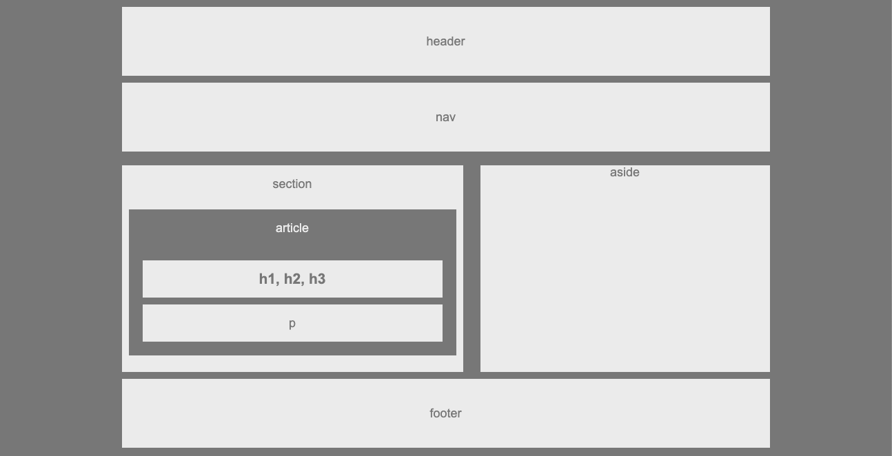

# HW-Wireframe

Wireframe is the first excercice from UC Berkeley coding Boot Camp.
That aims to use HTML and CSS.

## Quick start
Open index.html in your browser.

## excercice resolution Steps 

Build a web design skeleton:
* use semantic tags (header, nav, section, aside, article and footer).
* Use the property `float` and `clear` in the css. 

 ## technologies Used

* [HTML](https://developer.mozilla.org/en-US/docs/Web/HTML)
* [CSS](https://developer.mozilla.org/en-US/docs/Web/CSS)

## Author

Victoire Baron 

